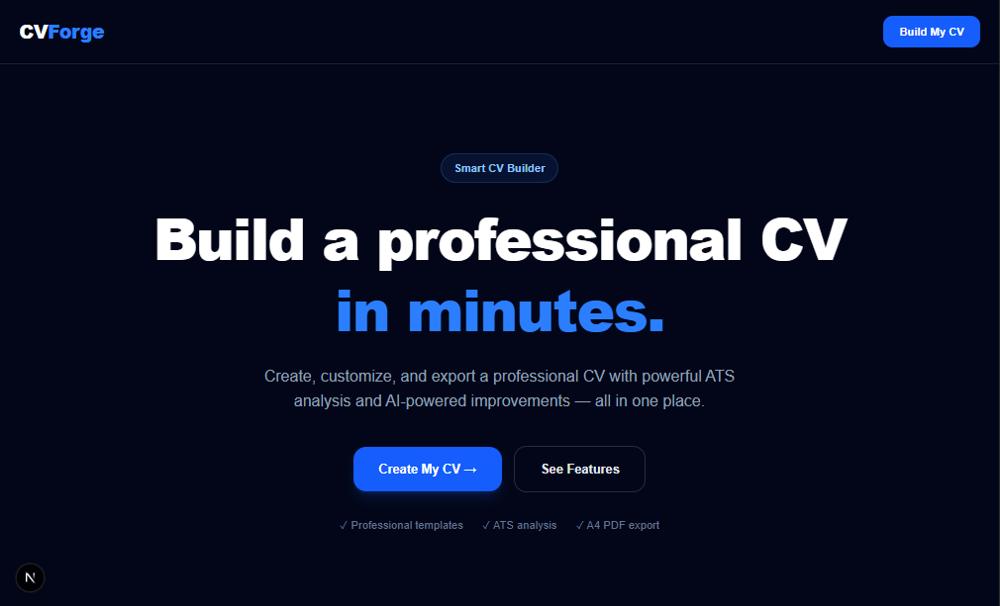
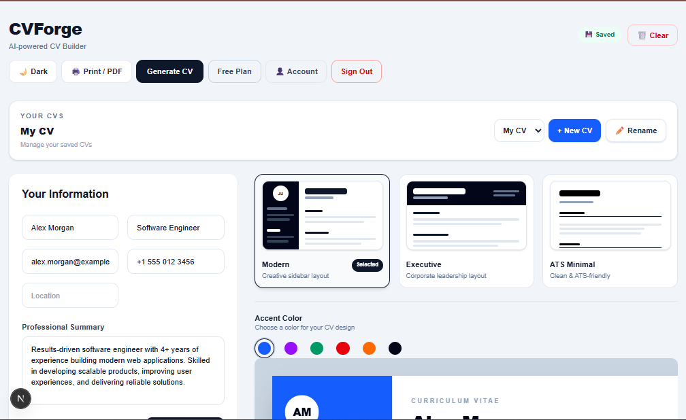
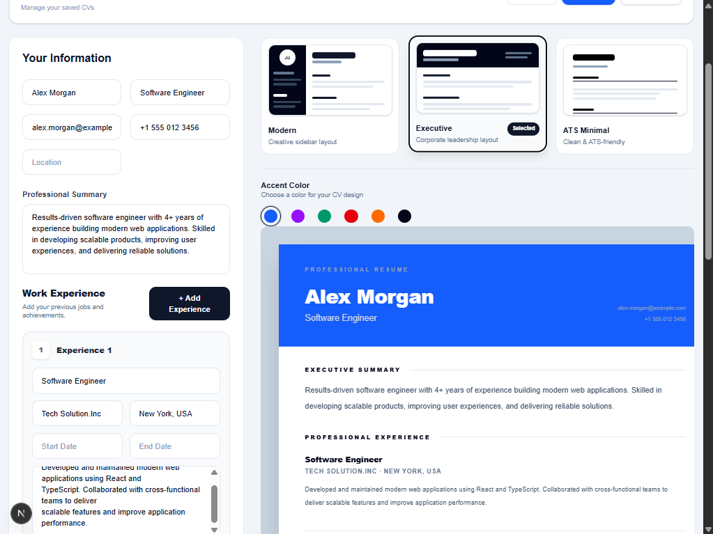
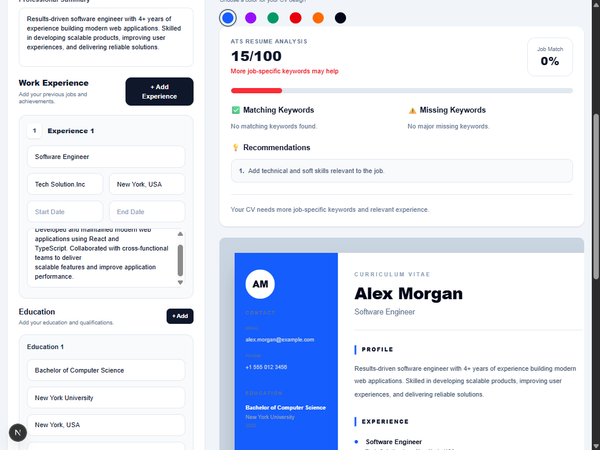
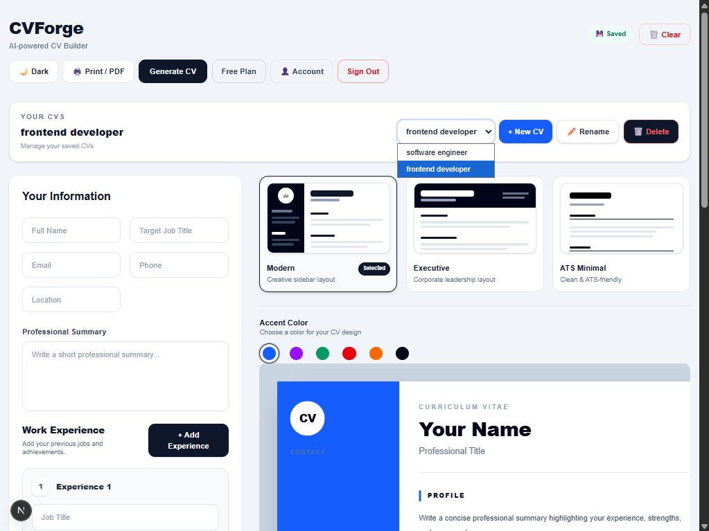

# CVForge — AI-Powered CV Builder

A modern web-based CV builder that helps users create professional, ATS-friendly resumes with customizable templates, AI-powered improvements, and live preview.

## 🚀 Features

- 📝 Real-time CV editor and preview
- 🎨 Modern, Executive, and Minimal templates
- 🌈 Customizable accent colors
- 🤖 AI-powered CV improvement
- 📊 ATS analysis and keyword matching
- 💾 Multiple CV saving and management
- 🔐 Firebase authentication
- 🌙 Light and dark mode
- 📄 Print-ready CV and PDF export
- 📱 Responsive desktop and mobile UI
- 🔍 SEO metadata, sitemap, and robots.txt
- 📜 Privacy Policy and Terms of Service

## 🛠️ Tech Stack

- Next.js
- React
- TypeScript
- Tailwind CSS
- Firebase Authentication
- Cloud Firestore

## 📸 Screenshots

### Landing Page



### CV Builder



### Templates



### ATS & AI



### CV Manager



## 🏗️ Project Structure

```text
app/
├── auth/
├── builder/
├── privacy/
├── terms/
├── template/
├── api/
├── tailor-education/
├── tailor-experience/
├── layout.tsx
├── page.tsx
├── sitemap.ts
└── robots.ts

firebase/
└── Firebase configuration and services
